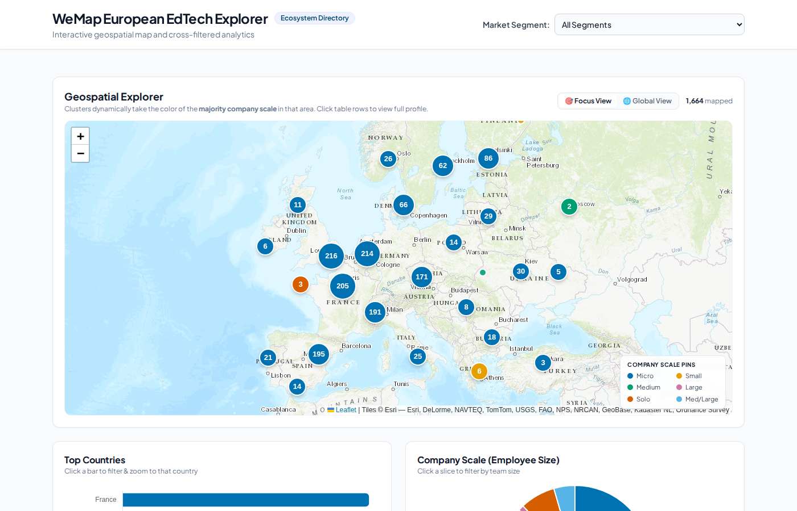

# WeMap European EdTech Explorer

An interactive geospatial dashboard for exploring the WeMap EdTech ecosystem — filterable by market segment, country, and company scale, with a clustered map, charts, and per-company profile drawer.



---

## Pipeline Overview

The project has a 3-step data pipeline that transforms a raw dataset into a fully standalone HTML dashboard.

```
raw xlsx  ──▶  geocode_cities.py  ──▶  geocoded xlsx  ──▶  generate_dashboard.py  ──▶  index.html
                                                  ╲
                                          download_logos.py  ──▶  logos/  (optional)
```

---

## Requirements

Install Python dependencies once:

```bash
pip install openpyxl requests
```

> [!NOTE]
> All scripts require only standard libraries plus `openpyxl` and `requests`. No API keys are needed.

---

## Step 1 — Geocode the Dataset

Reads the cleaned xlsx, resolves each unique `city_country` value to lat/lon via a free geocoding API, and writes a new `*_geocoded.xlsx` file.

```bash
# Auto-detects a non-geocoded *.xlsx in the current directory
python geocode_cities.py

# Or specify explicitly
python geocode_cities.py path/to/clean_dataset.xlsx

# Optional flags
python geocode_cities.py path/to/clean_dataset.xlsx \
  --out path/to/output_geocoded.xlsx \
  --provider nominatim \     # alternative to default 'photon'
  --cache path/to/cache.json # default: geocode_cache.json next to input
```

> [!TIP]
> Results are cached in `geocode_cache.json` — if the script is interrupted, re-running it resumes from where it left off without re-querying already-resolved cities.

> [!IMPORTANT]
> Run this locally, not in a sandboxed/network-restricted environment. Both providers (Photon and Nominatim) are free, open, no-API-key services. The script rate-limits itself to ~1 request/second to be polite to these shared services.

---

## Step 2 — (Optional) Download Logos

Downloads org logo images from the dataset into a local `logos/` directory for offline serving alongside the dashboard.

```bash
# Auto-detects *_geocoded.xlsx in CWD
python download_logos.py

# Or specify explicitly
python download_logos.py path/to/geocoded_dataset.xlsx

# Optional flags
python download_logos.py path/to/geocoded_dataset.xlsx \
  --logos-dir path/to/logos \
  --workers 20               # parallel download threads (default: 15)
```

> [!NOTE]
> `logos/` is excluded from version control (`.gitignore`). Re-run this script to repopulate on a new machine.

---

## Step 3 — Generate the Dashboard

Reads the geocoded xlsx and produces a single, fully self-contained `index.html` with all data embedded.

```bash
# Auto-detects *_geocoded.xlsx in CWD, outputs index.html
python generate_dashboard.py

# Or specify explicitly
python generate_dashboard.py --data path/to/geocoded_dataset.xlsx

# Optional flags
python generate_dashboard.py \
  --data path/to/geocoded_dataset.xlsx \
  --out  dashboard.html \
  --title "My Custom EdTech Map" \
  --sheet WeMap_Live_Data      # sheet name (default: WeMap_Live_Data)
```

> [!TIP]
> `compiled_tailwind.css` must be present next to `generate_dashboard.py` — it's inlined into the HTML at build time. If you update the Tailwind styles, rebuild it with `npx tailwindcss -i input.css -o compiled_tailwind.css`.

---

## Step 4 — Serve Locally

```bash
python serve_dashboard.py        # serves on http://localhost:8080
python serve_dashboard.py 9000   # or any other port
```

Open `http://localhost:8080` in your browser.

---

## Dashboard Features

| Feature | Description |
|---------|-------------|
| 🗺️ Geospatial map | Clustered pins coloured by majority company scale (Okabe-Ito palette) |
| 🔍 Cross-filtering | Filter by Market Segment, Country (bar chart), and Company Scale (donut) |
| 📋 Directory table | Searchable, paginated org table — click any row to open the profile drawer |
| 🪟 Profile drawer | Per-company view with description, products, metadata, and social links |
| 🎯 Focus / Global view | Toggle between a Europe-focused and worldwide map view |

---

## Rebuilding Tailwind CSS

The compiled CSS is committed to the repo so you don't need Node.js just to run the dashboard. If you modify `input.css` or `tailwind.config.js`:

```bash
npm install
npx tailwindcss -i input.css -o compiled_tailwind.css --minify
```

Then re-run `python generate_dashboard.py` to embed the updated styles.

---

## Project Structure

```
EEA_1/
├── generate_dashboard.py     # Step 3: xlsx → index.html
├── geocode_cities.py         # Step 1: add lat/lon to xlsx
├── download_logos.py         # Step 2 (optional): cache org logos locally
├── serve_dashboard.py        # Dev server for index.html
├── compiled_tailwind.css     # Pre-built Tailwind CSS (inlined into HTML)
├── input.css                 # Tailwind source (rebuild if styles change)
├── tailwind.config.js        # Tailwind config
├── package.json              # npm config for Tailwind
├── index.html                # Generated dashboard (do not edit by hand)
├── logos/                    # Downloaded logos (gitignored, regenerate locally)
└── geocode_cache.json        # Geocoding cache (gitignored, regenerate locally)
```
